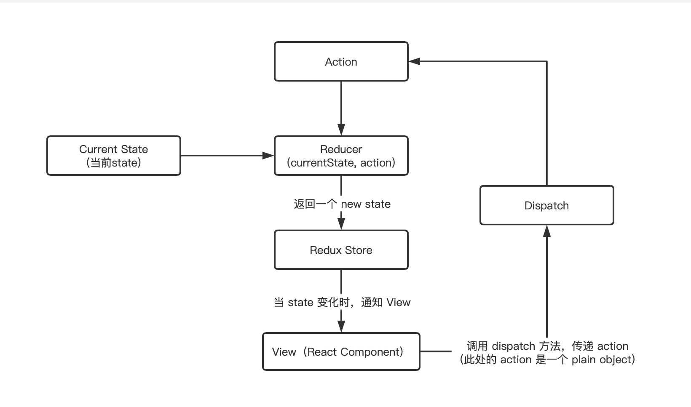

### redux
- React 应用最广的状态管理库：redux；其它的还有 mobx，市场相对 redux 较少一些。

- redux 只是一个纯粹的状态管理库，默认只支持同步，实现异步任务（比如延迟、网络请求），需要中间件的支持，如常用的 redux-thunk、redux-logger。

- redux 数据流向图


### redux 库的使用
- 提供了三个重要 API：createStore、applyMiddleware 和 combineReducers；
##### createStore
- `const store = createStore(reducer)；`
- 其中 reducer 只能是纯函数；
- store 中，有几个主要的 API：dispatch、getState、subscribe；
###### dispatch
- `dispatch({type: 'ADD'});`
- 默认情况下，dispatch 只能接受一个 plain object；当传入 function 或者 promise 时，需要使用中间件，如何使用？在 applyMiddleware 中展示；
###### getState
- `store.getState()`；
- 获取 store 中的所有状态信息；
###### subscribe
- `store.subscribe(()=> {this.forceUpdate()});`
- 订阅：当 store 中 state 发生变化时，需要告知组件进行更新；
- 通常情况下，订阅和取消订阅都是成对出现的；

##### combineReducers
- 当有多个 reducer 时，将其进行合并，然后传递给 createStore；
- `const store = createStore(combineReducers({count: counterReducer, num: numReducer}));`
##### applyMiddleware
- `const store = createStore(combineReducers({count: counterReducer}), applyMiddle('thunk', 'promise', 'logger'));`
- 当 store.dispatch 接受的不是一个 action 时，就需要使用中间件进行协助处理；

### 手写 redux 源码，顺道实现了三个常用中间件
- 手写实现 redux 中，基本实现了 redux 的所有常用功能，且全程无第三方框架，实现了纯手写所有代码；
- 并且实现了常用中间件：redux-thunk、redux-logger、redux-promise。

### 项目结构
```
|-- public：资源文件
    |-- index.html
|-- src
    |-- index.js：入口文件
    |-- pages
        |-- ReduxPage：使用 redux 框架的组件
        |-- YJReduxPage：使用自定义 yj-redux 框架的组件（可以和 ReduxPage 比较，可以发现用法完全一致）
    |-- store
        |-- store：使用 redux 创建 store，并且引入三个中间件
        |-- yj-store：使用 yj-redux 创建 store（可以和 store 中的内容比较，用法完全一致）
    |-- yj-redux：手写实现 redux 功能，包含了 createStore、combineReducers、applyMiddleware
        |-- createStore：包含了 getState、dispatch、subscribe 功能
        |-- combineReducers
        |-- applyMiddleware
    |-- middlewares：手写用到的中间件
        |-- redux-thunk
        |-- redux-logger
        |-- redux-promise
    |-- utils：手写中间件时发现用到了第三方库，这里手写一下中间件中用到的第三方库
        |-- is-promise：判断是否是 promise
```

### 学习
- 安装依赖：`npm install`;
- 运行项目：`yarn start`；
- 底下就可以看到效果，可以进行学习、调试。

### 函数式编程
- 函数式编程有两个最基本的运算：合成(compose)与柯里化(currying)；

##### 函数的合成
- 如果一个值要经过多个函数，才能变成另外一个值，就可以把所有中间步骤合并成一个函数，这就叫做“函数的合成”；
- 可以进行合成的函数必须要是一个“纯函数”，满足结合律：`compose(f, compose(g, h))` 等同于 `compose(compose(f, g), h)`;
- 代码示例：
  ```js
    // 合成之前： a -> c
    let b = fun1(a);
    let c = fun2(b);

    // 函数合成
    let compose = function(fun1, fun2) {
      return function(x) {
        return fun1(fun2(x));
      }
    }
  ```
- 上代码：
  ```js
    let f1 = (arg) => {
      console.log('f1', arg)
      return arg;
    }
    let f2 = (arg) => {
      console.log('f2', arg)
      return arg;
    }
    let f3 = (arg) => {
      console.log('f3', arg)
      return arg;
    }
    let f4 = (arg) => {
      console.log('f4', arg)
      return arg;
    }
    // 方法一：
    f1('perfect');
    f2('perfect');
    f3('perfect');
    f4('perfect');
    
    // 方法二：
    f4(f3(f2(f1('perfect'))));
    
    // 方法三：
    let res = compose(f1, f2, f3, f4)('perfect');
    console.log(res)

    function compose(...funcs) {
      if(funcs.length === 0) {
        return arg => arg;
      } else if(funcs.length === 1) {
        return funcs[0]
      } else {
        return funcs.reduce((a, b) => {
          return (arg) => b(a(arg));
        });
      }
    }
  ```

  ```js
    // redux 中源码
    function compose(...funcs) {
      if (funcs.length === 0) {
        return (arg) => arg
      }

      if (funcs.length === 1) {
        return funcs[0]
      }

      return funcs.reduce((a, b) => (...args) => a(b(...args)))
    }
  ```

##### 函数柯里化
- 概念：把一个多参数的函数，转化为单参数函数；
- 上代码
  ```js
  // 柯里化之前
  function add(x, y) {
    return x + y;
  }
  add(1, 2) // 3

  // 柯里化之后
  function addX(y) {
    return function (x) {
      return x + y;
    };
  }
  addX(2)(1) // 3
  ```
